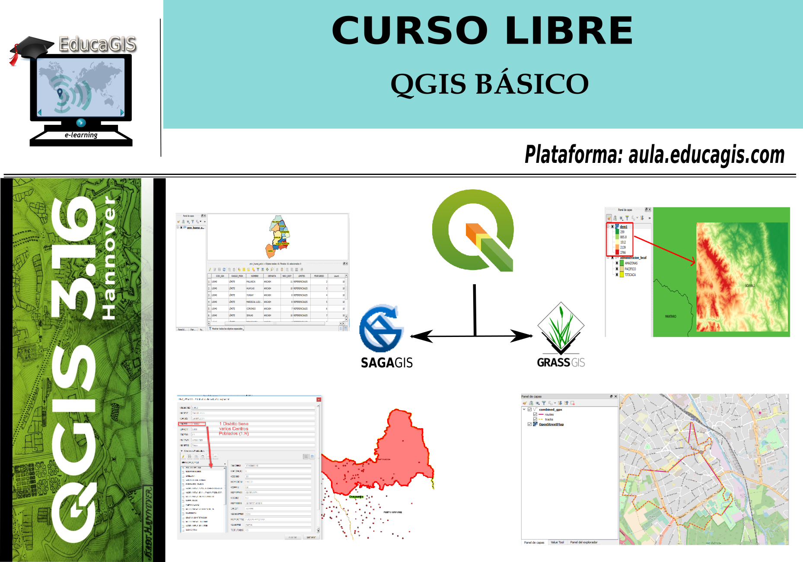

# Curso Básico de QGIS 3.X

## Introducción

En esta oportunidad vamos a presentar un curso básico de QGIS empleando la versión 3.16 **Hannover**, considerando que en la actualidad es la última versión que se considera un LTR.
